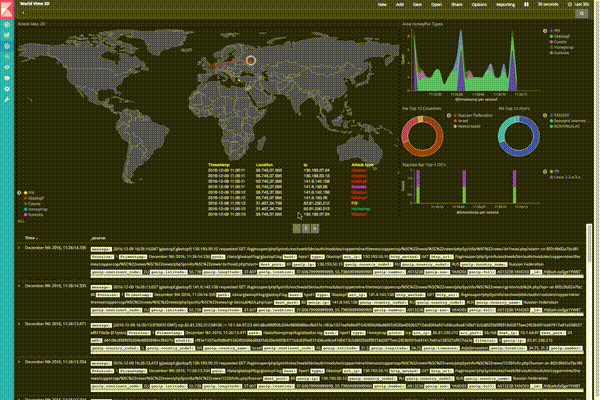

# Mapster

[](https://www.codacy.com/app/xarkes/mapster)

Mapster is a real-time event map implemented as a [Kibana](https://github.com/elastic/kibana) [visualization](https://www.elastic.co/guide/en/kibana/current/visualize.html).
# How does it work
Mapster is not truely in real-time. It fetches the events from ElasticSearch using Kibana and replays the events in real
time with a lag corresponding to the Kibana refresh time.

For best performances, Kibana dashboard should be set to collect events from last 30 seconds and to refresh every 30 seconds too.
The refresh rate should be equal to the window time.

To draw the 2D map, Mapster uses [d3js](https://d3js.org/) and it uses [threejs](https://threejs.org/) to draw the 3D globe.

# Installation
## Requirements
- Kibana 5.2.2

## Instructions
Simply clone the repository into your Kibana plugins folder:
```
 mkdir kibana && cd kibana
 git clone https://github.com/elastickent/mapster
 cd ../
 zip -r mapster.zip kibana
 $KIBANA_HOME/bin/kibana-plugin install file:///`pwd`/mapster.zip
```

If you are using Kibana from git and starting it in `dev` mode, Kibana will automatically refresh its cache and the plugin
will be successfully loaded.
Otherwise you can force it by stopping kibana, deleting the cache and starting kibana again.
```
rm -r optimize/bundles
./bin/kibana
```

From now, you should see that Mapster is available in the Visualization tab of Kibana. Now set your kibana events to
last 30 seconds, enable auto-refresh and enjoy !

# Configuration
To add Mapster to a dashboard, first create a new [visualization](https://www.elastic.co/guide/en/kibana/current/visualize.html).

## Important information
Notice that when customizing the visualization some options are not automatically refreshed and you might need to do a manual refresh (F5).

## Choosing correct aggregations
The metric should be set to `Count`.

The first aggregation is as described the timestamp matching the event. You should use a `Date Histogram` with the Interval set to `Seconds`.

The second aggregation is the event coordinates so you have to use a `Geohash` matching the event's origin.

The third aggregation is the target IP. It is used to aggregate multiple events from the same IP on the map.

The fourth aggregation is the sensor. The sensor is used to differentiate event types on the map.

Then you can add any other aggregation if you need to filter your events using the kibana search field.

## Plugin options
| Option name                   | Meaning                                                                                    |
|-------------------------------|--------------------------------------------------------------------------------------------|
| Use a 3D Map ?                | Well ... do you prefer a 2D plan or a 3D globe ?                                           |
| Object shape                  | The svg shape of the object thrown from the origin to the target.                          |
| Object scale                  | The scale of the above shape.                                                              |
| Object rotation               | The object rotation. If the object is looking to the top, the rotation is 90 degrees.      |
| Target coords                 | This is the location on the map of the target.                                             |
| Special effects               | The sensor field used to display the event as a special effect.                            |
| Special effects scale         | The scale of the special effects.                                                          |
| Special shape                 | Shape used to mark a special event on the map.                                             |
| Special scale                 | The scale of the above shape.                                                              |
| Special remaining time        | The duration the special shape stays on the map.                                           |
| Origin default size           | The default size of a circle (origin).                                                     |
| Origin maximum size           | The maximum size of a circle.                                                              |
| Origin dying time             | The time the origin dies.                                                                  |
| Hide events at (0,0)          | If some of your data are located at (0,0) you can choose to hide them or not.              |
| Enable explosions             | Do you want explosions ?!                                                                  |
| Explosion file                | The name of your explosion file (GIF format). It should be located under the img/ folder.  |
| Explosion height              | The height of the explosion file (if you want to resize it).                               |
| Explosion width               | The width of the explosion file (if you want to resize it too).                            |
| Explosion delay (in ms)       | The duration in ms of the gif.                                                             |
| Number of events in the logs  | Number of lines in the event logs table.                                                   |
|                               |                                                                                            |
